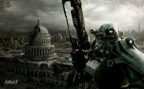
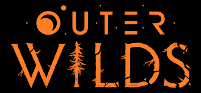
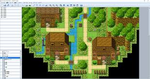
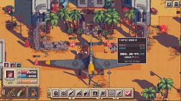

  
    Introduction

---

## What is Canopy?
**Canopy** is a 2D game engine built in Kotlin. It's built on top of LibGDX, and aims to be a simple yet powerful engine for creating 2D games. 
It will be open-source and free to use, and will be designed to be easy to learn and use, while also providing a solid 
foundation for more complex games.

## Before Canopy

**The origin for Canopy came from two places - love for **gaming**, and love for **Kotlin**.**

    
    

As an **avid gaming** fan turned software developer, I always wanted to **design my own games** and tell my own **stories**,
and so I searched far and wide. First, I came into contact with tools like **[RPG Maker](https://www.rpgmakerweb.com/)**,
and I started ideating my own stories.

    

For the time, I was focused on writing stories and so developed some small projects, but the **limitations** were very
tangible, so I searched for plugins to make the games more **flexible**. Nevertheless, the limitations were still there,
and so I had no choice but to find another way.

I then searched for more mature tools, and based my choices on my favorite games. I tried with **[Game Maker Studio](https://gamemaker.io/en)**,
for my love of **[Undertale](https://undertale.com/)** and **[Katana Zero](https://katanazero.com/)**;

    
    
    

I messed with **[Unity](https://unity.com/pt)** for my love of **[Hollow Knight](https://www.hollowknight.com/)** and
the idea of following a more industry-oriented approach.

    
    

But still, I was feeling like something was missing from them, as well as **college kicking in**,
and so I stopped and focused all my attention to school. There I **fell in love** with **[Kotlin](https://kotlinlang.org/)**,
and the **beauty** and **freedom** it gave me. Before that, the only experience I had in "industry languages" were a bit of C#
due to Unity, which at the time felt very **restrictive** and "Old", and so Kotlin brought a **fresh look**.

    

A year or so after I entered college, I saw a video about an engine. An engine where **composition** was a core principle,
where coding was made direct and with **no boilerplate**, something like Kotlin but in the game dev landscape.
This was **[Godot](https://godotengine.org/)**.

    

Since then, I fell in love with **Godot** and have been using it for my games, which I hope to someday release.

Well, college moved forward and I learned composition with **[React](https://react.dev/)** and **[Jetpack Compose](https://developer.android.com/compose)**,
and learned a lot about software development. But, even with all that knowledge of coding, and my love for game dev
made possible with Godot, **I felt something was missing**.

A year after I finished college and started working at a **consulting company**, me and some colleagues decided to start building
a **game**. One of them was an old colleague from college, so his **passion** for **Kotlin** was something we both shared, and so
we had the idea of making a game with it. I started searching for frameworks(and possible game engines), and learned about
one in particular that seemed interesting: **[LibGDX](https://libgdx.com/)**. Well we started messing around,
and something happened.

    

---

## Initial spark

**From my love** of the Godot workflow, I tried to bring that into the context of **LibGDX**, and so I started working with ECS.
But all the libraries had two major flaws:

* Only one component type per entity, so no duplicated Sprites, or anything similar
* No nested entities, so everything would be needed to be defined inside entities, systems, worlds.
* Wanted a more functional and yet readable as well as composable system.

[//]: # (<SKETCH OF ISSUES WITH OLD ECS VS DREAM ECS>)

And so, moved by a need to implement something **nicer** and **improve the workflow of all the team**, I tried my own approach.

---

## 2. A rough sketch

During the following months, I started implementing what became part of the **core principles of Canopy**. First, I started
designing the **node system**, which was the original idea after all. But before that, I implemented a small part of the framework,
but which became a **cornerstone** of it: **Signals**. At first, the idea was to design a more **readable** and **godot-like**
approach to signals, and so I designed the first version, very similar to the version we see today. But I kept working:

* I then kept working on the **node structure**, and so came the ideas of **behaviors** and **composable nodes** very naturally,
  as a similar system was present in Godot.

* Then, as things got more **stable**, I started working on other parts of it. I designed a simple **rendering system** with its
  own renderable nodes, but with no sprite support nor animation;

* Then I messed with **physics** and designed simple **Body2D** and **Area2D** nodes, akin to Godot, but with a touch of **[Box2D](https://box2d.org/)**;

* Finally, I started messing with **Animation** and adding tracks as it was the approach in **Godot**.

---

## The idea of a framework

During development, I started having the idea of moving this into a **separate project**, as this was becoming something with
a **scale of its own**. I moved it into a separate module and let the whole project **catch dust**. Months passed, and I
kept making my game in Godot, **slowly but steady**. And then, about **2 months** after last messing with it, I had the idea: what
if I took this, and made it something more "concrete"? After all, Kotlin was still missing a **proper game dev framework**,
one that felt both modern and direct, as well as designed with composition and declarative programming in mind.

> Note: LibGDX is still a fantastic framework, but it still feels Java-y, and other

> Note: there are some other Kotlin-first frameworks like KorGE, but they still felt a bit too imperative.

And so I started thinking about names, and came an idea (at this point I should give credit where credit is due to
ChatGPT, as without it, such a humongous task would have been impossible :) )

> Godot node-based structure  → tree-based structure → multiple trees make a forest → topmost layer that forms a
> continuous layer is called 'Canopy'🌳

---

## What it is and what it isn't

### What Canopy is:

✅A kotlin-first framework → it's built on kotlin principles, such as DSL, type and null-safe types.
✅A declarative framework → it's built with declarative and functional principles in mind, as opposed to imperative.
✅A composable framework → composition is a core principle from day one, as composition has many advantages over OOP.

### What Canopy isn't:

❌ A native framework → Canopy is still compiled into a .jar, and it doesn't compile your project into native(for now...)
❌ A fully-fledged framework → Canopy is still a work in progress, and maintained by one person, so have faith little one.
❌ A python library(this is for you Ricardo).

---