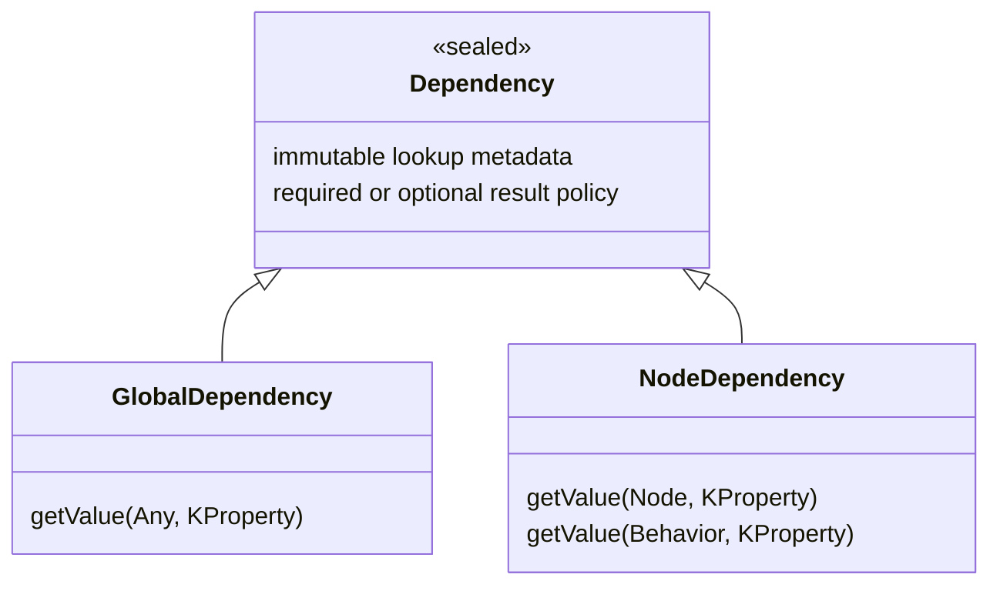

  

# Dependency resolution design

Dependencies describe a lookup, not a stored result or a subscription. A property declaration constructs immutable
metadata; each game-thread read searches the current registry or hierarchy. The implementation lives in
`engine/core/queries`, with factories split into `Queries.kt` and `NodeQueries.kt`.

## Core and receiver boundaries

`Dependency<T>` is sealed and has no delegation operator. It shares type/key metadata, required/optional policy and
missing-value diagnostic formatting. Its concrete classes are final, privately constructed through factory methods.
Consumers cannot introduce arbitrary resolver closures or subclass the hierarchy from another module.

`GlobalDependency<T>` currently resolves managers. Its receiver is deliberately unused: there is no implicit current
node, membership check or destroyed-owner check. Ordinary classes, objects, local/top-level properties and behaviors
without nodes use the same global lookup. Retaining the delegate retains neither its receiver nor a resolved service.

`NodeDependency<T>` offers only Node and Behavior receivers. A behavior supplies its constructor node; no node means
an absent single dependency or an empty group. A valid owner is checked before every lookup. This restriction is
compile-time receiver safety, not a runtime fallback from a global lookup into a scene tree.

## Selection contracts

| Resolver | Selection and membership |
| --- | --- |
| Ancestor | Nearest assignable actual ancestor, excluding owner; contexts remain ancestors |
| Child | First assignable direct visible child in insertion order; transparent wrappers expand their children |
| Tree | First entered assignable node in iterative preorder from owner's root; includes root and owner |
| Group | Entered assignable members from owner's manager, in group registration order; fresh list per read |
| Typed context | Nearest scope registering the exact declared type; starts at owner |
| Keyed context | Nearest scope registering the string key; validates non-null value against requested type |
| Manager | Current assignable registration in global ManagersRegistry |

Detached valid nodes still have usable hierarchy and contexts. Tree lookup has no result until owner entry; group lookup
returns an empty list. A group is scoped to the owning manager, so it may contain nodes in other entered hierarchies.
Single node lookups choose by documented order rather than rejecting multiple matches.

A nearest context registration shadows outer registrations even when its provider returns null. Providers run on every
read and failures propagate. Typed and keyed registrations are independent. Traversal is not cached, so reparenting,
child replacement and membership changes need no dependency-cache invalidation.

## Errors, state safety and compatibility

Required absence throws NoSuchElementException with property name, lookup kind, type/key and scope. Optional reads
return null for absence only. Groups represent absence with an empty snapshot. Wrong keyed types, provider errors,
manager ambiguity and invalid node owners remain errors. Global resolution never needs destroyed node diagnostics.

Compiler node-state checks accept only delegated concrete GlobalDependency and NodeDependency fields. Runtime
NodeDefinition validation recognizes those exact final field types, protecting precompiled and Java consumers.
The sealed base is not a supported stored field type. Descriptors retain metadata only; a result retained separately by
application code has ordinary Kotlin lifetime and can outlive its registration without remaining a current lookup.

This refactor changes factory JVM return types. Recompile consumers; replace explicit Dependency annotations used
for delegation with the concrete type. Keep immediate manager lookup separate from delegated factories.

## Verification and related systems

`DependencyTests` covers selection, reparenting, entry, snapshots, context shadowing and owner destruction.
`GlobalDependencyTests` covers receiver independence, current registration, direct nullable access, ambiguity and shutdown.
`CanopyCompilerTests` covers concrete delegates, unsupported receivers, stored descriptors and the non-delegating base.

Read [Managers and injection](managers.md), [Node state and lifecycle](nodes-and-scenes.md),
[Reactive flows](flows.md) and the [user dependency guide](../manuals/concepts/core/dependencies.md).

---

[Documentation index](/markdown/index.md)

Canopy Engine Documentation • 2026

