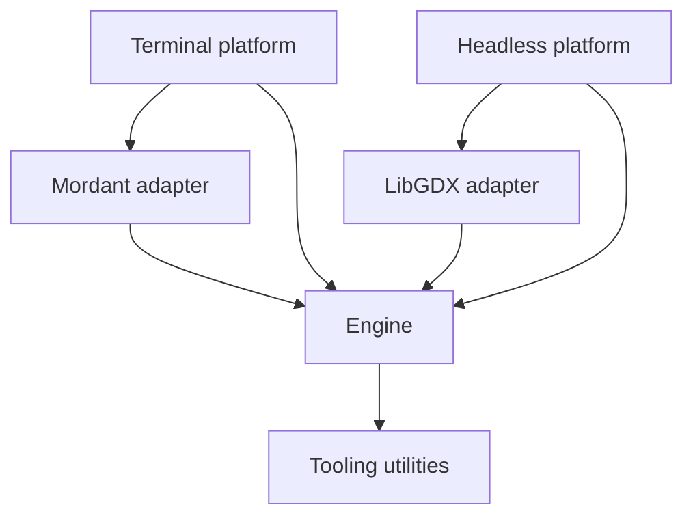

  

# Engine architecture

The current snapshot is **0.1.0-dev2**. Modules enabled in the engine settings:

| Gradle module | Responsibility |
| --- | --- |
| `:engine` | App lifecycle, nodes, managers, flows, math, input, data and logging |
| `:adapters:libgdx` | LibGDX host and backend integration |
| `:adapters:mordant` | Terminal input integration |
| `:platforms:headless` | LibGDX headless application |
| `:platforms:terminal` | Interactive terminal application and filesystem assets |
| `:tooling:utils` | Shared Kotlin utilities |
| `:tooling:devtools` | Development tooling |
| Included build `compiler` (`tooling/compiler`) | Compiler rules and Gradle integration, packaged as isolated host artifacts |

`:platforms:desktop` remains in the source tree but is excluded from the build.
Core, data, input and logging are packages in `:engine`, not separate artifacts.
The compiler is built in the Gradle plugin included build so its integration can
be used during project configuration; it is not a runtime engine dependency.
Compiler rules implement `CanopyCompilerRule` and register service providers.
The shared runner handles traversal and diagnostics; node-state safety is mandatory.

The platform drives `App.engineLoop`. `EngineLoop` coordinates entry, variable
frame updates, fixed physics steps, resize and exit. App lifecycle dispatches
managers; `ScreenManager` owns screen navigation and `SceneManager` owns the
current node tree and phase-ordered tree systems.

Nodes supply hierarchy and optional behavior; tree systems process matching
nodes across the scene. Context scopes supply values to descendants. Reactive
values are independent of the scene and execute callbacks synchronously.

Global services resolve through GlobalDependency; hierarchy/context queries resolve through
NodeDependency. Both share sealed Dependency metadata and missing-value handling, but only
node lookups require a node owner. See [dependency design](dependencies.md).

These structures are mutable and belong to one serialized engine thread.
Snapshot iteration protects selected dispatch loops from callback mutations,
but does not make concurrent tree or registry mutation safe.

Command definitions, argument validation, synchronous execution, and the guarded
`CommandPrompt` node belong to `:engine`. `TerminalApp` installs the host routing
and terminal presentation automatically, using input from `:adapters:mordant`.
Focused routing runs before gameplay mapping so prompt editing does not also
activate gameplay input. Presentation remains in the terminal platform; commands
do not depend on Mordant or a future UI runtime. See [Command prompts](../manuals/concepts/app/command-prompts.md).

## Subsystem design

Read [runtime and screens](runtime.md), [nodes and scenes](nodes-and-scenes.md),
[managers](managers.md), [flows](flows.md), [resources and data](resources-and-data.md),
[commands and input](commands-and-input.md), [math](math-and-transforms.md), and
[integration/tooling](integration-and-tooling.md). The [design overview](engine-details.md)
connects each page to its user manual and tests.

---

  Canopy Engine Documentation • 2026

