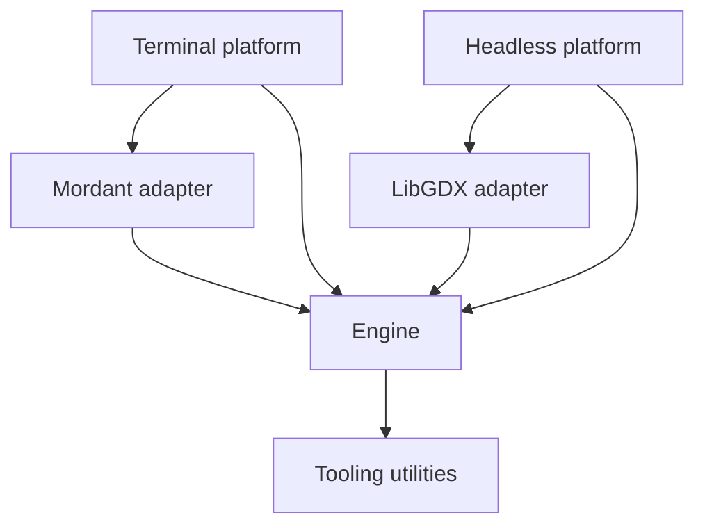

  

# Engine architecture

The current snapshot is **0.1.0-dev2**. Modules enabled in the engine settings:

| Gradle module | Responsibility |
| --- | --- |
| `:engine` | App lifecycle, nodes, managers, flows, math, input, data and logging |
| `:adapters:libgdx` | LibGDX host and backend integration |
| `:adapters:mordant` | Terminal input integration |
| `:platforms:headless` | LibGDX headless application |
| `:platforms:terminal` | Interactive terminal application and filesystem assets |
| `:tooling:utils` | Shared Kotlin utilities |
| `:tooling:devtools` | Development tooling |
| Included build `:engine-compiler` (`engine/compiler`) | Kotlin compile-time validation rules |
| Included build `compiler-gradle-plugin` | Installs engine checks in game compilations |

`:platforms:desktop` remains in the source tree but is excluded from the build.
Core, data, input and logging are packages in `:engine`, not separate artifacts.
The compiler is built in the Gradle plugin included build so its integration can
be used during project configuration; it is not a runtime engine dependency.
Compiler rules implement `CanopyCompilerRule` and register service providers.
The shared runner handles traversal and diagnostics; node-state safety is mandatory.

The platform drives `App.engineLoop`. `EngineLoop` coordinates entry, variable
frame updates, fixed physics steps, resize and exit. App lifecycle dispatches
managers; `ScreenManager` owns screen navigation and `SceneManager` owns the
current node tree and phase-ordered tree systems.

Nodes supply hierarchy and optional behavior; tree systems process matching
nodes across the scene. Context scopes supply values to descendants. Reactive
values are independent of the scene and execute callbacks synchronously.

These structures are mutable and belong to one serialized engine thread.
Snapshot iteration protects selected dispatch loops from callback mutations,
but does not make concurrent tree or registry mutation safe.

---

  Canopy Engine Documentation • 2026

