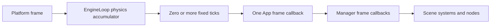

  

# Application runtime and screens

The platform owns the host loop; App owns application setup; EngineLoop coordinates the lifecycle independently of a
window or terminal. This lets tests drive the same entry, frame, resize and exit paths without launching a backend.

## Startup and frame ordering

App entry acquires its selected logging session, replaces the previous global manager scope, registers platform-provided
managers, then
InjectionManager, ScreenManager and SceneManager, then applies the application manager builder. Registry entry calls
managers in registration order. SceneManager configuration sets the fixed physics step before application entry hooks.
`onEnter` and `afterEnter` run before the startup completion is signalled. Startup errors fail lifecycle completions.
Failed entry cannot be retried; App rolls back partial initialization
by attempting its shutdown hooks, manager cleanup and logging shutdown. Cleanup errors are suppressed on the original
startup failure. Manager cleanup must tolerate registrations whose entry never started or did not finish.

Delta values are seconds, finite and nonnegative. Physics steps must be finite and positive. Each frame dispatches at
most five physics ticks by default before one variable update; remaining accumulated time is retained. Pause transitions
clear the fractional remainder. Updates and resizes require an entered loop; repeated entry and exit are idempotent,
and an exited loop cannot restart. During entry, frame, physics and resize callbacks, nested loop lifecycle calls are
rejected before state changes; use AppHandle.requestExit for a backend-managed graceful shutdown.

Pause does not stop the host loop. Application frame hooks get zero gameplay delta while paused; its physics hook is
skipped. SceneManager receives real frame deltas and physics ticks so Always/WhenPaused nodes and cleanup continue.
Other managers receive zero frame delta and no physics ticks. Screen callbacks inherit ScreenManager's dispatch policy.
Node process modes are enforced by scene traversal, not by events or direct method calls.

## Screens and scene ownership

ScreenManager registers concrete screen types. Starting a different registered type ends the current visit, then calls
onEnter and onActive for the target. Starting the current instance is a no-op. A missing target fails before navigation.
The visit version prevents a screen that navigates away inside onEnter from subsequently receiving onActive.

Leaving clears current first, attempts onInactive and onExit, and preserves the first failure with later suppression.
Registration and navigation are rejected during those teardown callbacks. ScreenManager is a service distinct from
SceneManager: a screen can install a scene, but screens do not themselves become node-tree owners.

## Shutdown, handles and threads

App exit attempts beforeExit, manager teardown, logging session end and the application exit callback independently,
then closes only its acquired session. The exit callback still runs within the session context before its resources
close. A host-owned session has no backend resources to stop. If session context setup fails before a cleanup action,
App records that failure and attempts the missed action in host context. An action already invoked is not repeated
when context restoration fails.
The stopped completion is signalled only after all cleanup attempts; the first failure is preserved with later errors
suppressed. An application exit callback failure therefore fails the stopped completion. Manager teardown clears
registrations even after callback failures. EngineLoop marks itself exited
before calling shutdown, so repeated calls do not repeat teardown.

`launch` runs the platform launch on the caller thread; blocking behavior belongs to the platform. `launchAsync` creates a
non-daemon thread and returns AppHandle. Await/start and join methods observe completion; timeout variants return false
for failed waits as well as timeouts. Graceful requestExit uses backend callbacks or interrupts the launch thread.
forceClose is backend-defined and may halt the JVM when no callback is available.

Registry, node and screen operations remain serialized on the engine thread. A launch handle does not turn arbitrary
manager mutation into a thread-safe operation. Terminal input producers enqueue events; the lifecycle thread drains them.

## Verification

EngineLoopTests covers lifecycle ordering, finite deltas, physics caps and pause transitions. ScreenManagerTests covers
navigation and failure cleanup. App behavior is exercised by devtools CanopyAppTests and headless/terminal application
tests. See [Application guide](../manuals/concepts/app/application.md), [Screens](../manuals/concepts/app/screens.md),
and [Nodes and scenes](nodes-and-scenes.md).

---

[Documentation index](/markdown/index.md)

Canopy Engine Documentation • 2026

