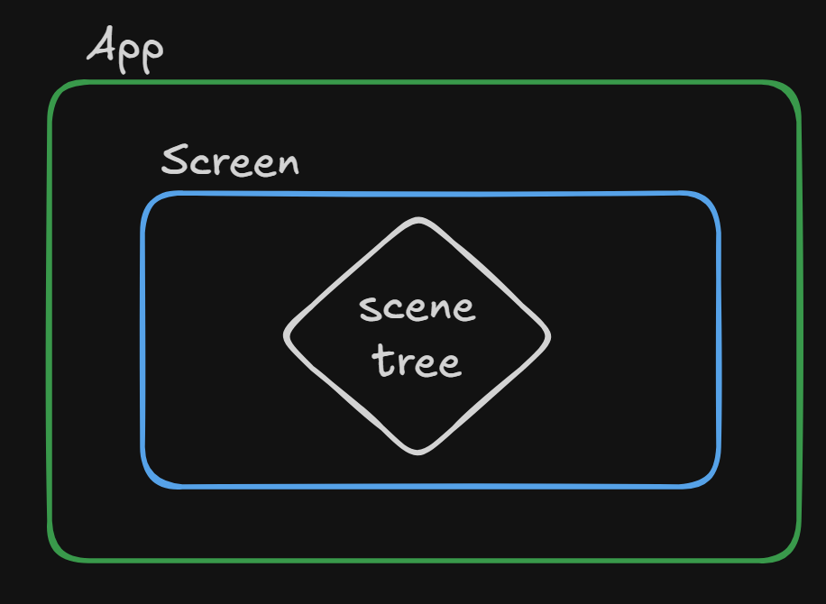

<p style="display: flex; align-items: center; gap: 10px;">
  <a href="/markdown/index.md">
    
  </a>
</p>

# Screens

Screens represent **high-level application states**: a main menu, gameplay,
settings or a loading screen. A screen can choose the scene tree for that state
and keep the application-level callbacks together.



---

# Working with the Current API

`Screen` and `ScreenManager` are in `io.canopy.engine.app`.
Screens group application states; a screen can install a scene, but it is not a node.

```kotlin
import io.canopy.engine.app.Screen
import io.canopy.engine.app.screens
import io.canopy.engine.core.nodes.types.empty.EmptyNode
import io.canopy.platforms.terminal.app.terminalApp

class GameScreen : Screen() {
    override fun onEnter() {
        EmptyNode("World").asSceneRoot()
    }
}

fun main() = terminalApp {
    screens { start(GameScreen()) }
}.launch()
```

The registry DSL supports `screen(instance)`, `+instance`, `-Type::class`,
`start<Type>()` for registered types and `start(instance)` to register and start.
Screens are registered by concrete class; another instance of the same class
replaces the registration. Starting an unregistered type fails.

## Runtime navigation shortcuts

After application managers are registered, use the App extensions for runtime
registration, navigation and removal. Import them from `io.canopy.engine.app`:

```kotlin
import io.canopy.engine.app.App
import io.canopy.engine.app.registerScreen
import io.canopy.engine.app.startScreen
import io.canopy.engine.app.removeScreen

fun showGame(app: App<*>) {
    app.registerScreen(GameScreen())
    app.startScreen<GameScreen>()
}

fun unregisterGame(app: App<*>) {
    app.removeScreen<GameScreen>()
}
```

These calls forward to the existing global `ScreenManager`, so they use the same
registry as `manager<ScreenManager>().register(instance)`, `.start(Type::class)`
and `.remove(Type::class)`. The App receiver does not create a separate registry.
Use them on the serialized lifecycle thread; they fail if no ScreenManager is
registered. Registering does not start a screen or preload its resources.
Starting requires an existing registration and does not replace the scene or
add a visual transition. Removing an unregistered type is a no-op.

Keep `screens { ... }` for bootstrap configuration. Calling that builder again
does not perform runtime navigation. The shortcuts preserve the lifecycle and
teardown restrictions described below.

## Lifecycle: entering, being active and leaving

Think of navigation as a visit to a screen. A registered instance can be visited
more than once; its callbacks bracket each visit.

| Moment | Callbacks, in order |
| --- | --- |
| Start a different screen | Previous `onInactive()`, previous `onExit()`, target `onEnter()`, target `onActive()` |
| Start the current instance | None — this is a no-op |
| Remove or replace the active instance | `onInactive()`, then `onExit()`; current becomes null |
| Shut down | Active `onInactive()`, then `onExit()`; clear all registrations |

`onEnter()` runs again when returning to a screen. Use it for visit setup, and
`onExit()` for the corresponding cleanup. A screen that was never started does
not receive exit callbacks, and an earlier visit is not exited a second time at
shutdown. Only the current screen receives update, physics-update and resize
callbacks. Registering the same instance again leaves its visit untouched;
registering a replacement ends the old visit but does not start the new one.

`current` is cleared before leaving callbacks and points to the target during
entering callbacks. Navigation from `onEnter()` is supported; if it redirects,
the screen that already left does not receive a late `onActive()`. Screen
navigation and registration changes from `onInactive()` or `onExit()` fail with
`IllegalStateException`, preventing overlapping teardown. If `onInactive()`
throws, `onExit()` still runs. The first failure propagates to the caller, with
an additional exit failure attached as a suppressed exception.

A screen exit does not automatically remove its scene. Scene replacement belongs
to [SceneManager](../core/nodes/scene-manager.md).

---

## Keep Exploring

➡ **[Documentation Index](/markdown/index.md)** — choose the next concept or guide.

---

<p align="center">
  Canopy Engine Documentation • 2026
</p>

## Current size on navigation

The screen manager remembers the latest nonnegative host width and height. After
a screen's `onEnter()` and `onActive()` complete, its `onResize(width, height)`
receives that geometry even if the host has not resized during navigation.
Zero-sized viewports are valid. Before the first host resize there is no geometry
to replay. Shutdown clears the remembered size.

Navigation inside entry, activation or resize callbacks only resizes the visit
that remains active. Starting the current screen does not repeat its entry or
activation; if its previous resize failed, it retries that pending geometry.
Starting the current screen from its own resize callback does not recurse.
