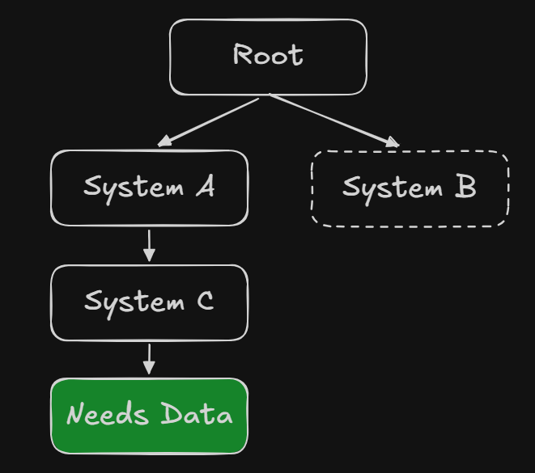
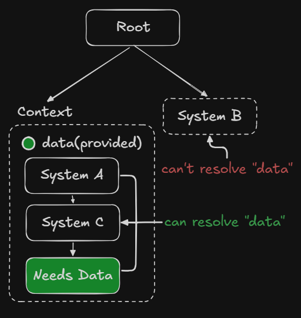

<p style="display: flex; align-items: center; gap: 10px;">
  <a href="/markdown/index.md">
    
  </a>
</p>

# Contexts

Contexts help nodes **share data across a subtree**, so a simulation's children
can read the same configuration without every parent forwarding it manually.

> [!NOTE]
> The idea is similar to **React Context**: the nearest provider supplies the
> value. Canopy implements the scope as a transparent node in the tree.

---

# Why Contexts Exist

Many systems require access to shared data defined higher in the scene tree.

Without contexts, developers typically rely on one of two patterns.

---

## Global Managers

A common approach is to create singleton managers:

```
GameStateManager
```

While convenient, this introduces several problems:

* everything can access the manager
* lifetime becomes global
* systems can become tightly coupled
* scenes become harder to reuse

---

## Prop Drilling

Another approach is manually passing data through the node hierarchy.



Each node forwards the data to the next node.

This leads to:

* boilerplate code
* tight coupling
* fragile hierarchies

---

Contexts provide **scoped dependency sharing** when a subtree is the right owner for a value.


---

# Mental Model

Contexts behave like **value providers attached to the node tree**.



Example:

```
Root
 └ Context (difficulty = normal)
      ├ Enemy
      └ Context (difficulty = hard)
           └ Boss
```

Resolving `difficulty`:

| Node  | Value      |
| ----- | ---------- |
| Enemy | `"normal"` |
| Boss  | `"hard"`   |

Context resolution always returns the **closest provider in the node tree**.


---

# Working with the Current API

`Context`, `ContextKey`, `fromContext`, `fromContextOrNull`, `lazyFromContext`,
and nullable lazy variants are in `io.canopy.engine.core.flows`.
Context is a transparent node providing values to its subtree.

```kotlin
import io.canopy.engine.core.flows.Context
import io.canopy.engine.core.flows.fromContext
import io.canopy.engine.core.nodes.behavior
import io.canopy.engine.core.nodes.types.empty.EmptyNode

val root = EmptyNode("Root") {
    Context {
        provide("difficulty") { 3 }
        EmptyNode("Game") {
            behavior(onReady = {
                val difficulty = fromContext<Int>("difficulty")
                check(difficulty == 3)
            })
        }
    }
}
```

Construction attaches contexts and children through the active node DSL.
Lookup starts at the receiving node and walks parents. The closest provider key
wins. Providers run on lookup; values are not automatically memoized or reactive.
Lazy variants cache the first resolved result through Kotlin `lazy`.

`fromContextOrNull` returns null for a missing key. `fromContext` throws
`NoSuchElementException` for missing/null results. An existing null-returning
provider does not fall through to an outer provider. A wrong requested type can
cause a cast error: raw string keys are not runtime type checking.

Prefer an enum implementing `ContextKey` with `override val key: String` for
shared keys. Context nodes have generated names and are skipped during node path
search. Context is distinct from [global managers](../managers/managers.md);
its values belong to a subtree. Access contexts on the lifecycle thread.


---

## Typed providers and dependencies

For type-based dependency access, register a provider under its declared type:

```kotlin
import io.canopy.engine.core.flows.Context
import io.canopy.engine.core.nodes.Node
import io.canopy.engine.core.queries.context
import io.canopy.engine.core.queries.contextOrNull

data class GameRules(val startingScore: Int)

class Player(name: String) : Node<Player>(name) {
    val rules by context<GameRules>()
    val optionalDifficulty by contextOrNull<Int>("difficulty")
}

val scope = Context("Rules") {
    provide<GameRules> { GameRules(10) }
    provide("difficulty") { 3 }
    Player("Player")
}
```

Typed providers match the exact declared Kotlin class: register an implementation
as its interface type with `provide<MyService> { implementation }` when consumers
request that interface. The closest scope with that type wins, even if its
provider returns null. Provider functions run on every delegated read; exceptions
propagate. `contextOrNull<T>()` returns null for missing/null providers, while
`context<T>()` throws `NoSuchElementException` identifying the dependency.

Typed providers and keyed providers are independent. Keyed delegates accept
both strings and `ContextKey`, preserve nearest-key shadowing, and check the
returned value's runtime class. An incompatible keyed value throws
`IllegalStateException`, including for optional delegates. Generic arguments
inside a class are erased by the JVM, so these queries cannot validate list
element types. Existing `fromContext` and lazy variants retain their behavior.

Reads are confined to the game thread. Moving a consumer changes the visible
scope at its next read; no dependency cache needs invalidation. Reusable
detachment preserves provider definitions. Permanent destruction invalidates
consumer reads and releases provider state through the existing node lifetime.

# Best Practices

### Prefer typed keys

Use enums implementing `ContextKey` instead of raw strings.

### Keep contexts focused

Contexts should represent clear logical scopes such as:

* simulation
* UI layer
* level
* gameplay system

### Prefer structured values

Instead of many keys:

```
world
time
weather
```

Prefer grouping related data:

```
simulationState
```

### Shadow intentionally

Avoid accidental overrides by using clear keys.


---

## Keep Exploring

➡ **[Documentation Index](/markdown/index.md)** — choose the next concept or guide.

---

<p align="center">
  Canopy Engine Documentation • 2026
</p>
