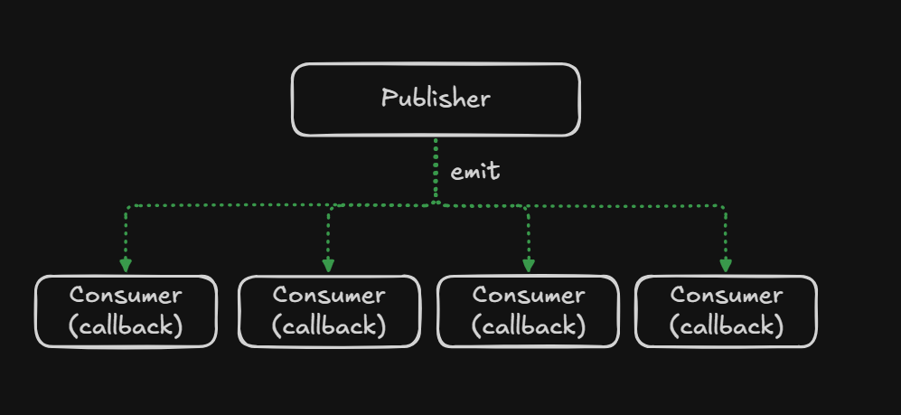
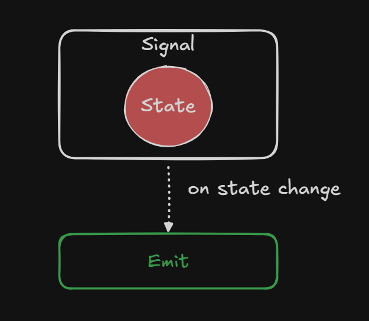

<p style="display: flex; align-items: center; gap: 10px;">
  <a href="/markdown/index.md">
    
  </a>
</p>

# Events, signals, computed values and effects

A game has moments that happen and values that keep changing. **Events** let you
announce a moment; **signals** let other parts of your game observe a value.
Computed values and effects build on those signals to connect related logic.

---

# Rule of Thumb

**Events represent things that happen.
Signals represent values that change.**

Examples:

| Situation      | Use    |
| -------------- | ------ |
| Player died    | Event  |
| Enemy spawned  | Event  |
| Item picked up | Event  |
| Player health  | Signal |
| Gold amount    | Signal |
| Score          | Signal |


---

# Working with the Current API

Import these APIs from `io.canopy.engine.core.flows.events`.

## Events

An event connects the part of your game that announces something to the parts
that care about it. The publisher does not need to know each consumer.




`event()`, `event<A>()`, and `event<A, B>()` create events with zero to two
arguments. `connect` returns an `EventDisconnectHandler`; call `disconnect()`
to unsubscribe. Events also expose listener-based `disconnect`, `clear`,
`size`, and `isEmpty`. `emit` invokes callbacks synchronously on the caller's thread.

```kotlin
import io.canopy.engine.core.flows.events.event

val changed = event<Int>()
val listener: (Int) -> Unit = { value -> check(value >= 0) }
val subscription = changed.connect(listener)
changed.emit(1)
subscription.disconnect()
```

Callbacks are weakly referenced. Retain the callback or disconnect handle for
as long as the subscription is needed; an unowned inline callback may disappear
after garbage collection. Connections created in managed node lifecycle, behavior
or tree-system node callbacks automatically belong to that node: the lifetime
retains the handle and disconnects it on exit or removal. Outside those callbacks,
use `changed.connect(ownerNode) { value -> ... }` for explicit ownership. Signals
also support `state.connect(ownerNode) { value -> ... }`. Manual handle
disconnection releases the node's ownership registration immediately.

Ownership is assigned when a connection is created. Later event listener calls
do not open an ownership scope; use an explicit owner for nested subscriptions
created during those calls. Copy-on-write listener storage allows subscription
changes during emission, but does not serialize application state in callbacks.

## Signals

A signal keeps the current value available between changes. Health, score and
inventory totals are values you can read now and observe as the game progresses.




```kotlin
import io.canopy.engine.core.flows.events.signal
import io.canopy.engine.core.flows.events.computed

val health = signal(100)
val alive = computed { health() > 0 }
val current = health()
health.update { it - 10 }
val stillAlive = alive()
```

Read with `signal()`; its internal value is private. `update` replaces the value
and emits only when old and new are unequal. `asSignal()` wraps an existing
value. Callbacks are synchronous; `flow` replays the current value to new
collectors and can drop intermediate values for slow collectors.

Signals require serialized reads/writes on one thread. Volatile visibility is
not atomic read-modify-write. Mutating an object already stored in a signal does
not trigger equality-based notification: prefer replacement immutable values.

## Computed values

`computed { ... }` initializes lazily on first read or observation. Reads of
signals/computed values track dependencies. Recomputations replace subscriptions
with the newly read dependency set. Use `untrack { state() }` to read without
tracking. Keep computed blocks free of state-changing side effects.

## Effects

`effect { ... }` runs immediately and reruns for changes in tracked dependencies.
Effects created during managed node callbacks are retained and disposed by the
node lifetime. Outside those callbacks, use `effect(ownerNode) { ... }` for the
same ownership, or retain the returned Effect and call `dispose()` manually.
Disposal also releases the ownership registration. Effect dependency tracking
connections and computed dependencies remain internal rather than independently
owned by the node. Later effect runs do not open an ownership scope; supply
explicit owners for nested resources created during those runs.
Dependencies are discovered after a run. Changes to an already subscribed
dependency during a run request **one coalesced rerun after that run**; effects
that keep changing their dependencies indefinitely can keep rerunning.
A first-run write before subscriptions exist is not guaranteed a rerun.

Effects execute synchronously, not in a background task or frame queue.
Tracking uses thread-local frames; effect/signal state remains intended for one
serialized thread. Dispose disconnects dependencies and suppresses later runs.


---

## Keep Exploring

➡ **[Documentation Index](/markdown/index.md)** — choose the next concept or guide.

---

<p align="center">
  Canopy Engine Documentation • 2026
</p>
