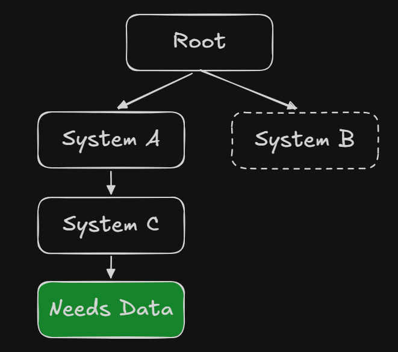
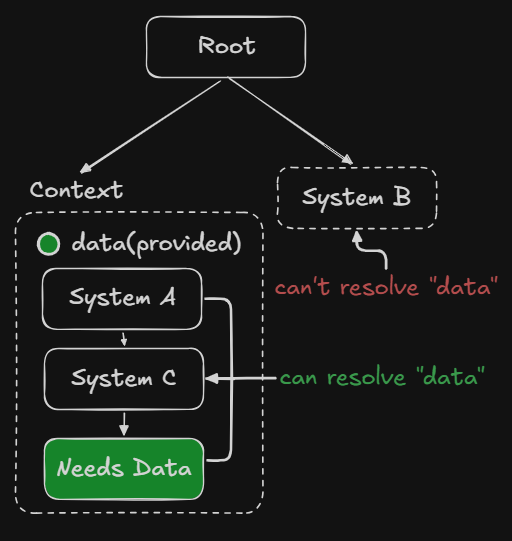
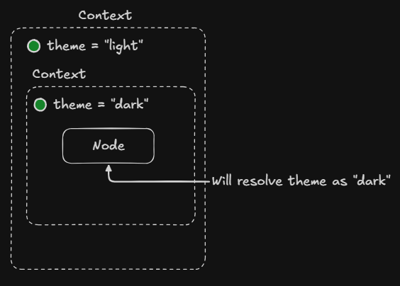

<p style="display: flex; align-items: center; gap: 10px;">
  <a href="/markdown/index.md">
    
  </a>
</p>

# Contexts

In many games, some systems need access to shared data that originates from higher up in the scene tree.

A common solution is to store this data inside **singleton managers**. While this works, it introduces several 
architectural questions:

* Should this data be accessible **globally** to every system?
* Should the data live **for the entire application lifecycle**?
* How do we pass shared data to **deeply nested nodes** without tightly coupling them?

To address these problems, Canopy introduces **Contexts**.

> [!NOTE]
> Contexts are conceptually similar to **[React Contexts](https://react.dev/learn/passing-data-deeply-with-context)**.

> [!WARNING]
> Contexts are still under development and may evolve in future versions.

---

# What Problems Contexts Solve

Without contexts, sharing data between nodes often leads to one of these patterns:

### Global Managers

You create a singleton manager:

```
GameStateManager
```

This makes data easy to access but creates several issues:

* Everything can access it
* Lifetime is global
* Difficult to isolate systems
* Harder to test or reuse scenes

### Prop Drilling

Another approach is passing data manually through many nodes:



Each node must forward the data to the next node.

This leads to:

* Boilerplate
* Tight coupling
* Fragile code when hierarchy changes

---

Contexts solve both problems by introducing **scoped dependency sharing**.

---

# What is a Context

A **Context** creates a **scope in the node tree** where specific data can be provided and accessed by any node 
inside that scope.

Nodes inside the context can **resolve** the data without needing to know where it came from.

Nodes outside the context **cannot access it**.

This allows data to be:

* **Scoped to a subtree**
* **Decoupled from global managers**
* **Accessible anywhere inside the subtree**



---

# Creating a Context

To create a context, use the `Context` node.

Inside it, use `provide()` to expose values to the subtree.

```kotlin
EmptyNode("root") {

    Context {

        provide("data") { data }

        EmptyNode("inside-context")

    }

    EmptyNode("outside-context")

}
```

✅ Any node inside the `Context` can access `"data"`.

❌ Nodes outside the context **cannot**.

---

# Accessing Context Data

To retrieve data from the nearest context, use the `resolve` method.

```kotlin
val data = resolve("data")
```

`resolve()` searches **up the node tree** until it finds a matching provided value.

This allows deeply nested nodes to access shared data without needing direct references.

---

# Context Shadowing

Contexts can be **nested**. When this happens, a child context can **override values provided by a parent context**.

This behavior is called **context shadowing**.

When a node resolves a value, Canopy searches **up the node tree** and returns the **closest matching provider**. 
If multiple contexts provide the same key, the **nearest one takes precedence**.

---



If `ButtonNode` resolves `"theme"`:

```
resolve("theme") -> "light"
```

Even though a parent context provides `"dark"`, the **nearest context shadows the parent value**.

---

## Example

```kotlin
EmptyNode("root") {

    Context {
        provide("difficulty") { "normal" }

        Context {
            provide("difficulty") { "hard" }

            EmptyNode("enemy")
        }
    }
}
```

Inside `enemy`:

```kotlin
val difficulty = resolve("difficulty")
```

The value will be:

```
"hard"
```

because the **inner context overrides the parent one**.

---

## Why Context Shadowing Is Useful

Context shadowing allows you to **customize behavior locally** without affecting the rest of the scene.

Examples include:

### Level Overrides

A game might provide a global difficulty:

```
difficulty = normal
```

But a specific area could override it:

```
boss arena difficulty = hard
```

---

### UI Theming

A global UI theme might exist:

```
theme = dark
```

But a menu or panel might override it:

```
theme = light
```

---

### Simulation Settings

A simulation may provide shared parameters:

```
weather = sunny
```

But a specific biome may override them:

```
weather = rainy
```

---

## Best Practices

### Only shadow intentionally

Shadowing should be used **when you want to override behavior locally**.
Avoid using the same key unintentionally, as this may cause confusing behavior.

---

### Use meaningful keys

Prefer clear names to avoid accidental shadowing:

```kotlin
provide("simulationDifficulty")
```

instead of:

```kotlin
provide("difficulty")
```

if multiple systems could define difficulty values.

---

### Keep context scopes focused

Contexts should represent **clear logical scopes**, such as:

* a simulation
* a UI layer
* a level
* a specific gameplay system

---

# Summary

Context shadowing allows nested contexts to **override values from parent contexts**.

When resolving a value, Canopy always returns the **closest provider in the node tree**.

This enables:

* localized configuration
* reusable scenes
* flexible system overrides

without introducing global state.

---

# Why Use Contexts

Contexts are useful when:

### You want scoped data

Example:

* Simulation state
* UI theme
* Level configuration

### You want to avoid global state

Not everything needs to live in a global manager.

### You want reusable scenes

A scene can depend on context values instead of specific global systems.

### You want cleaner architectures

Contexts remove the need for:

* singleton abuse
* dependency plumbing
* manual wiring

---

# When to Use Contexts vs Managers

| Use Contexts When           | Use Managers When                |
| --------------------------- | -------------------------------- |
| Data belongs to a subtree   | Data is global                   |
| Lifetime is temporary       | Lifetime is entire game          |
| Systems should be decoupled | Systems are core engine services |
| You want scene portability  | Global access is expected        |

Examples:

**Contexts**

* Simulation state
* Level-specific services
* UI themes
* Local configuration

**Managers**

* Asset manager
* Scene manager
* Audio manager
* Input manager

---

# Best Practices

### Keep contexts small

Contexts should provide **focused data**, not entire systems.

### Prefer structured values

Instead of many keys:

```
provide("world")
provide("time")
provide("weather")
```

Prefer:

```
provide("simulationState")
```

### Avoid deep dependency chains

If too many nodes depend on a context, consider whether it should be a manager instead.

---

# Summary

Contexts provide a way to:

* Share data across a subtree
* Avoid global state
* Reduce coupling between nodes
* Improve scene modularity

They enable **cleaner and more scalable architectures**, especially for large simulations and complex scene trees.
