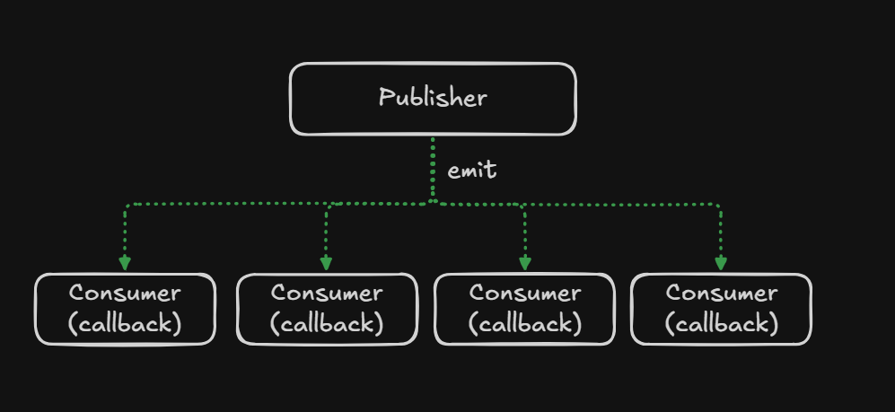
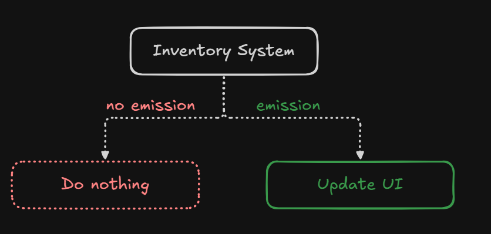
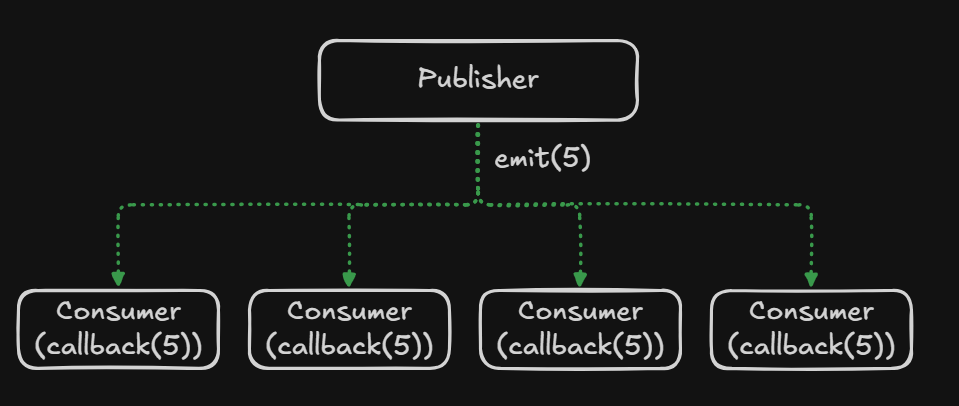
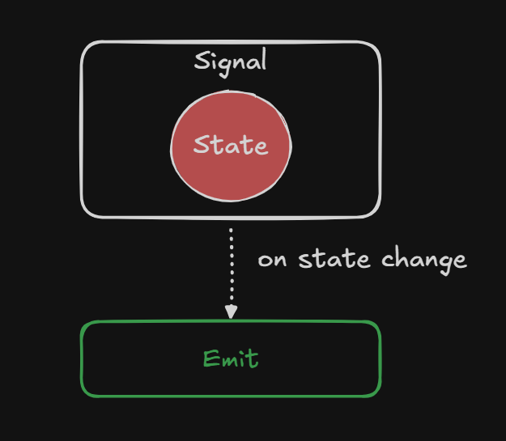

<p style="display: flex; align-items: center; gap: 10px;">
  <a href="/markdown/index.md">
    
  </a>
</p>

# Events and Signals

Canopy provides a **reactive programming system** through **Events** and **Signals**.

These tools allow systems to **react to changes** without tight coupling between components.

Instead of constantly checking for updates (polling), components can **subscribe to changes and respond automatically** 
when something happens.

This approach leads to:

* cleaner architectures
* less boilerplate
* better separation of concerns
* more reactive systems

---

# Events

Events implement the **Observer Pattern**.

Observer Pattern

In this pattern, there are two types of participants:

| Role           | Description       |
| -------------- | ----------------- |
| **Publisher**  | Emits events      |
| **Subscriber** | Listens to events |

When an event is emitted, all subscribers are notified.



> [!NOTE]
> Event are conceptually similar to [Godot Signals](https://docs.godotengine.org/en/stable/getting_started/step_by_step/signals.html)
---

# Why Events Are Useful

Consider the following scenario.

You have an **inventory system** that stores the player's items and resources.

```kotlin
object Inventory {
    var gold = 0
}
```

You also have a **UI component** displaying the player's gold.

One naive approach would be **polling**:

```kotlin
while(true) {
    updateGoldUI(Inventory.gold)
}
```

This approach has several problems:

* Requires continuous loops
* Consumes unnecessary CPU resources
* Hard to maintain
* Each listener needs its own polling logic

A much cleaner solution is **subscribing to events**.

With events, the UI only reacts **when the value actually changes**.



---

# Using Events

Using events involves four simple steps.

---

# 1. Define an Event

An event is essentially a **container of callbacks** that share the same function signature.

When the event is emitted, all callbacks are executed.

```kotlin
val noArgEvent = event()
// Supports () -> Unit callbacks

val oneArgEvent : OneArgEvent<Int> = event()
// Supports (Int) -> Unit callbacks

val twoArgsEvent = event<Int, Int>()
// Supports (Int, Int) -> Unit callbacks
```

The generic parameters define **the arguments that subscribers receive**.

---

# 2. Define a Callback

Subscribers define a function (or lambda) that matches the event's signature.

```kotlin
val callback = {
    println("Event called")
}
```

For an event with arguments:

```kotlin
val callback = { value: Int ->
    println("Received value: $value")
}
```

---

# 3. Subscribe to the Event

Subscribers register callbacks using `connect`.

```kotlin
noArgEvent connect callback
```

or

```kotlin
noArgEvent.connect(callback)
```

You can also pass lambdas directly.

```kotlin
noArgEvent connect {
    println("Lambda event called")
}
```

---

# 4. Emit the Event

When the publisher emits the event, all registered callbacks are executed.

```kotlin
noArgEvent.emit()

oneArgEvent.emit(5)

twoArgsEvent.emit(3, 5)
```

Every subscriber receives the data immediately.



---

# Signals

Signals are a **specialized form of events** that also **store state**.

They are conceptually similar to signals used in frameworks like:

* [Angular](https://angular.dev/guide/signals)
* [Preact](https://preactjs.com/blog/introducing-signals/)
* [SolidJS](https://docs.solidjs.com/concepts/signals)

A **signal** represents a value that automatically **notifies subscribers when it changes**.

---

# Why Signals Exist

Consider the following variable:

```kotlin
var gold = 0
```

If we want to notify other systems when this value changes, we might write:

```kotlin
val onGoldChange : OneArgSignal<Int> = createSignal()

gold = newValue
onGoldChange.emit(newValue)
```

This introduces potential problems:

* Developers might **forget to emit the event**
* Two pieces of logic must stay **synchronized**
* Code becomes more error-prone

Signals solve this by **combining state and events into a single abstraction**.



---

# Using Signals

Signals simplify reactive state management.

---

# 1. Define a Signal

You can create a signal with an initial value.

```kotlin
val gold = signal(0)
```

or

```kotlin
val gold = 0.asSignal()
```

---

# 2. Subscribe to the Signal

Signals behave like events, so you can subscribe using `connect`.

```kotlin
gold.connect { value ->
    println("Gold updated: $value")
}
```

---

# 3. Update the Value

To update the signal, modify its `.value`.

```kotlin
gold.value = newValue
```

When the value changes:

* the signal updates its internal state
* all subscribers are automatically notified

**No manual event emission is required.**

---

# Reading a Signal Value

You can access the current value using `.value`.

```kotlin
log.info { "Gold is: ${gold.value}" }
```

---

# Using Signals with Kotlin Flows

Signals can also be used with Kotlin **Flows** for asynchronous or coroutine-based workflows.

Kotlin Flow

```kotlin
gold.flow.collect {
    println("Value: $it")
}
```

This allows signals to integrate naturally with **coroutines and reactive pipelines**.

---

# Disconnecting and Automatic Cleanup 

> [!WARNING]
> This section is a work-in-progress and some features may not be available

Subscribers can **disconnect** from events or signals if they no longer want to receive updates.

This is useful when:

* a node is destroyed
* a UI component disappears
* a system no longer cares about updates

Example:

```kotlin
val connection = gold.connect(callback)

connection.disconnect()
```

---

📌 **Diagram suggestion**

```
Subscriber ── connect() ──► Signal
Subscriber ── disconnect() ──╳ Signal
```

In most cases, Canopy can **automatically clean up connections when nodes leave the tree**, preventing callbacks 
from referencing destroyed objects.

This helps avoid common problems such as:

* memory leaks
* callbacks to destroyed nodes
* dangling references

---

# Derived / Computed Signals

> [!WARNING]
> This section is a work-in-progress and some features may not be available

Signals can also be used to create **derived values**.

A derived signal automatically updates when its **dependencies change**.

Example:

```kotlin
val health = signal(80)
val maxHealth = signal(100)

val healthPercent = computed {
    health.value.toFloat() / maxHealth.value // health() / maxHealth()
}
```

Now whenever either `health` or `maxHealth` changes, `healthPercent` automatically updates.

```
health   ─┐
          ├──► computed ───► healthPercent
maxHealth ┘
```

This is extremely useful for:

* UI displays
* derived statistics
* gameplay logic
* reactive calculations

Example UI usage:

```kotlin
healthPercent.connect {
    updateHealthBar(it)
}
```

The health bar now updates automatically whenever health changes.

---

# Events vs Signals

| Feature                       | Events           | Signals        |
| ----------------------------- | ---------------- | -------------- |
| Holds state                   | ❌                | ✅              |
| Emits manually                | ✅                | ❌              |
| Automatically emits on change | ❌                | ✅              |
| Best for                      | discrete actions | reactive state |

---

# When to Use Each

Use **Events** when something **happens**:

Examples:

* player died
* enemy spawned
* level completed
* item picked up

---

Use **Signals** when **state changes over time**:

Examples:

* player health
* gold amount
* score
* simulation time

---

# Summary

Events and Signals enable **reactive systems** in Canopy.

They allow systems to:

* communicate without tight coupling
* react automatically to changes
* reduce polling logic
* build scalable architectures

**Events** represent **things that happen**, while **Signals** represent **state that changes**.

Together, they form a powerful foundation for building responsive and maintainable game systems.
